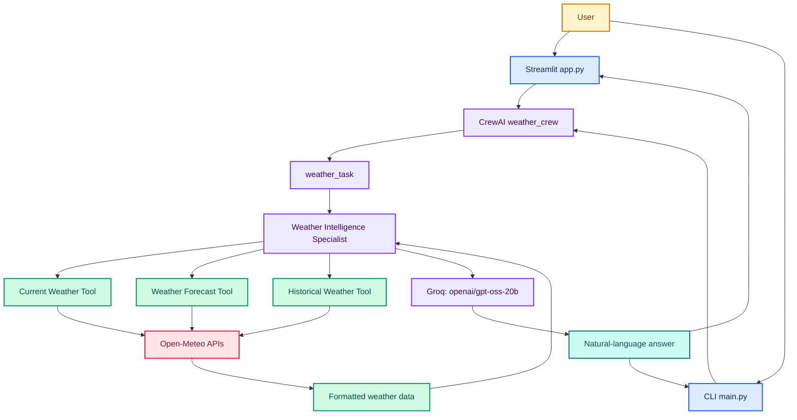
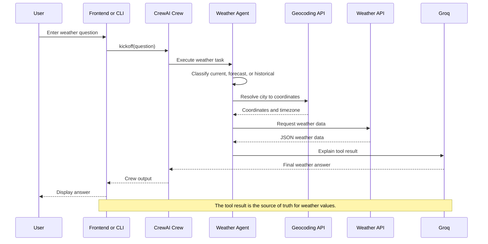
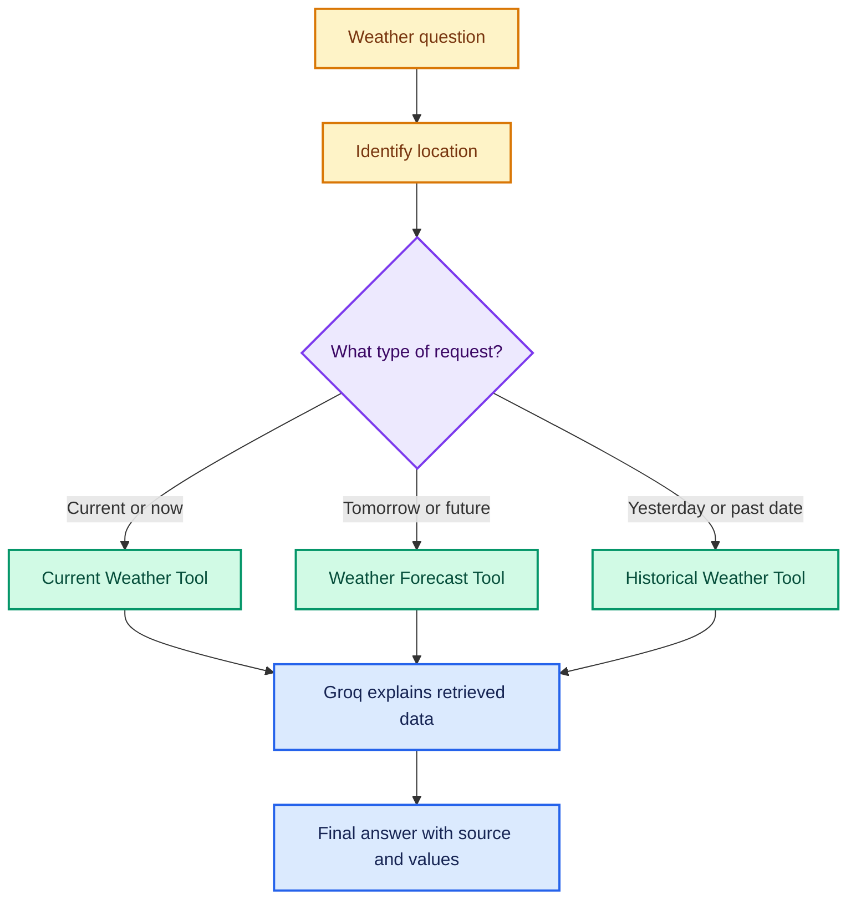
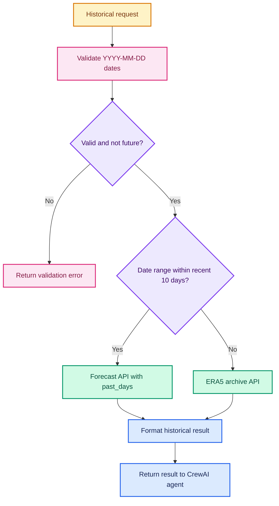
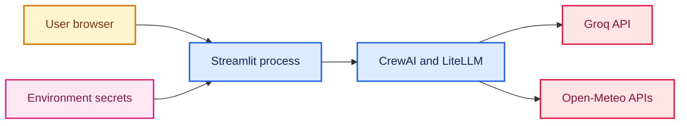
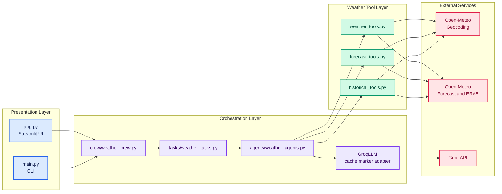
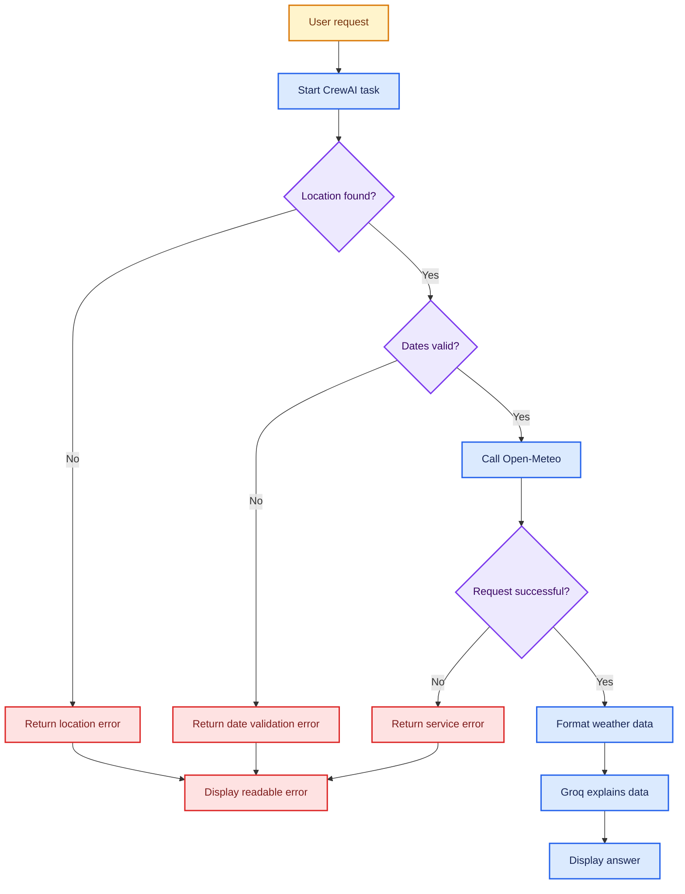
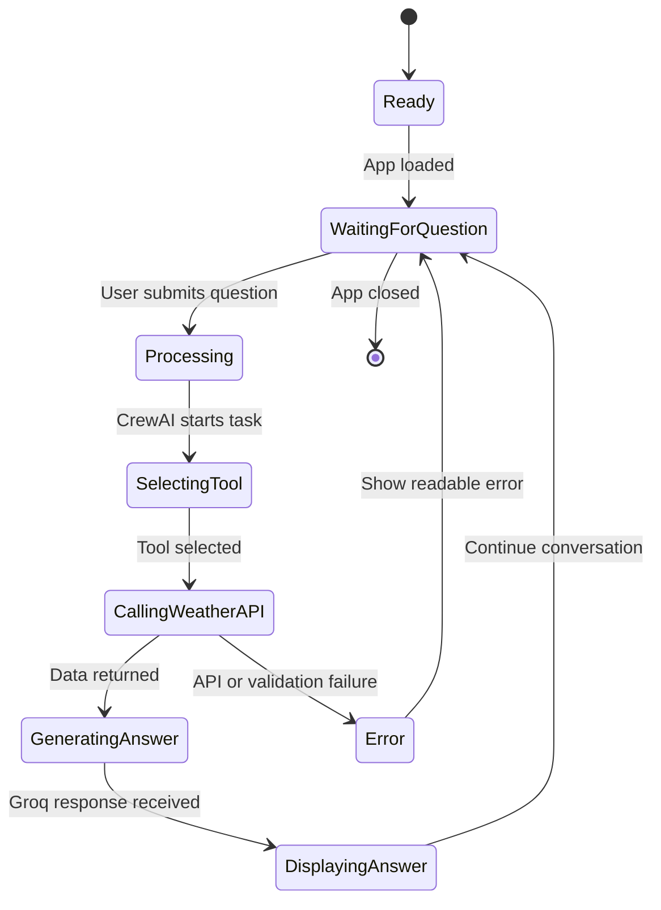

# WeatherAI

WeatherAI is a production-minded Python prototype for natural-language weather lookup. It combines a Streamlit interface, a CrewAI orchestration layer, Open-Meteo data services, and Groq inference using `openai/gpt-oss-20b`.

The system separates factual retrieval from language generation: Open-Meteo provides the weather values, while Groq turns the retrieved data into a concise answer. This prevents the model from inventing numerical weather information.

### Capabilities

- Current conditions for a named location
- Forecasts from tomorrow through 16 days
- Recent historical weather using past hourly observations
- Older historical weather using the ERA5 archive
- Streamlit chat UI with session history and example prompts
- CLI workflow for terminal-based use
- Direct smoke tests for configuration, Groq, and weather APIs

## Contents

- [Architecture](#architecture)
- [Requirements](#requirements)
- [Installation](#installation)
- [Configuration](#configuration)
- [Run The Application](#run-the-application)
- [Request Lifecycle](#request-lifecycle)
- [Weather Tools](#weather-tools)
- [Project Structure](#project-structure)
- [Testing](#testing)
- [Deployment](#deployment)
- [Troubleshooting](#troubleshooting)
- [Security Notes](#security-notes)
- [Limitations](#limitations)

## Architecture

### High-Level Architecture



### Request Sequence



### Agent Decision Flow



### Historical Data Routing



### Deployment Shape



### Component Relationships



### Failure And Recovery Flow



### Data Transformation Pipeline

```mermaid
flowchart LR
    Question[Plain-language question] --> Intent[Intent and location]
    Intent --> Coordinates[Latitude, longitude, timezone]
    Coordinates --> Params[API request parameters]
    Params --> JSON[Open-Meteo JSON]
    JSON --> Formatter[Tool formatter]
    Formatter --> Evidence[Structured weather evidence]
    Evidence --> Explanation[Groq explanation]
    Explanation --> Response[User-facing response]

    classDef question fill:#FFF4CC,stroke:#D97706,color:#78350F,stroke-width:2px;
    classDef transform fill:#DBEAFE,stroke:#2563EB,color:#172554,stroke-width:2px;
    classDef data fill:#D1FAE5,stroke:#059669,color:#064E3B,stroke-width:2px;
    classDef language fill:#EDE9FE,stroke:#7C3AED,color:#3B0764,stroke-width:2px;
    class Question question;
    class Intent,Coordinates,Params,Formatter transform;
    class JSON,Evidence data;
    class Explanation,Response language;
```



### Runtime State Model



## Requirements

- Python 3.12 or newer
- `pip` or `uv`
- A valid Groq API key
- Internet access
- A supported operating system for Python and Streamlit

Runtime dependencies are listed in [requirements.txt](requirements.txt) and [pyproject.toml](pyproject.toml):

- `crewai`
- `python-dotenv`
- `requests`
- `streamlit`
- `langchain-groq`
- `litellm`

## Installation

### Windows PowerShell

```powershell
cd C:\weather_prediction_done
python -m venv .venv
.\.venv\Scripts\Activate.ps1
python -m pip install --upgrade pip
pip install -r requirements.txt
```

If PowerShell blocks activation for the current terminal, run:

```powershell
Set-ExecutionPolicy -Scope Process -ExecutionPolicy RemoteSigned
```

Then activate the environment again.

### macOS or Linux

```bash
cd weather_prediction_done
python3 -m venv .venv
source .venv/bin/activate
python -m pip install --upgrade pip
pip install -r requirements.txt
```

## Configuration

Create a `.env` file in the project root. Never commit a real API key.

```env
GROQ_API_KEY=your_groq_api_key
```

The application always uses:

```text
openai/gpt-oss-20b
```

The model is pinned in `agents/weather_agents.py`; no model override is required in `.env`.

## Run The Application

### Streamlit Web App

```powershell
streamlit run app.py
```

Open the URL printed by Streamlit, usually `http://localhost:8501`.

The web app provides:

- A chat input
- Conversation history for the current browser session
- Example questions in the sidebar
- A clear conversation button
- Current, forecast, and historical weather workflows

### Command-Line App

```powershell
python main.py
```

Enter one question when prompted. The result is printed in the terminal.

### Direct Tool Checks

```powershell
python test_tools.py
python test_forecast.py
python test_historical.py
```

These scripts call weather tools directly without asking the LLM to route the request.

## How A Request Works

1. `app.py` or `main.py` receives the question.
2. The frontend or CLI calls `weather_crew.kickoff(inputs={"question": question})`.
3. `weather_task` tells the agent to classify the request.
4. The agent chooses one registered weather tool.
5. The selected tool geocodes the location.
6. The tool calls the appropriate Open-Meteo endpoint.
7. The tool formats API values into readable text.
8. Groq explains the factual tool result.
9. CrewAI returns the final answer to the frontend or CLI.

## Weather Tools

### Current Weather Tool

Defined in `tools/weather_tools.py`.

Input:

```text
location: city name
```

Process:

1. Search the Open-Meteo geocoding endpoint.
2. Select the first matching location.
3. Request current weather using latitude, longitude, and automatic timezone.
4. Return current conditions.

The result can contain temperature, feels-like temperature, humidity, dew point, wind, precipitation, cloud cover, visibility, pressure, UV index, weather code, and whether it is day or night.

### Weather Forecast Tool

Defined in `tools/forecast_tools.py`.

Input:

```text
location: city name
forecast_days: integer from 1 through 16
```

The tool requests one extra day so it can skip today and return the requested future days. It returns daily minimum and maximum temperatures, precipitation, rain probability, wind, gusts, UV index, sunrise, and sunset.

### Historical Weather Tool

Defined in `tools/historical_tools.py`.

Input:

```text
location: city name
start_date: YYYY-MM-DD
end_date: YYYY-MM-DD
```

The tool rejects invalid dates, reversed ranges, and future dates. Recent requests use the forecast API's `past_days` option. Older requests use the Open-Meteo ERA5 archive API.

## Project Structure

```text
weather_prediction_done/
|-- app.py                         Streamlit web application
|-- main.py                        Command-line application
|-- pyproject.toml                 Project metadata and dependencies
|-- requirements.txt               pip dependency list
|-- README.md                      This documentation
|-- .env                           Local secrets; do not commit
|-- tomorrow_client.py             Optional Tomorrow.io example client
|-- agents/
|   `-- weather_agents.py          Agent and Groq compatibility adapter
|-- config/
|   `-- settings.py                Configuration placeholder
|-- crew/
|   `-- weather_crew.py            Crew composition
|-- tasks/
|   `-- weather_tasks.py           Routing and answer instructions
`-- tools/
    |-- weather_tools.py           Current weather tool
    |-- forecast_tools.py          Forecast tool
    |-- historical_tools.py        Historical weather tool
    `-- test_historical.py         Tool-level historical check
```

## Important Modules

### `agents/weather_agents.py`

Creates the weather agent, registers all weather tools, loads environment values, and pins the model to `openai/gpt-oss-20b`. `GroqLLM` removes CrewAI's internal cache marker before LiteLLM sends the request to Groq.

### `tasks/weather_tasks.py`

Defines the classification rules and expected answer format. The task requires the agent to use real tool output and avoid invented numbers.

### `crew/weather_crew.py`

Creates a sequential CrewAI crew with the weather agent and weather task.

### `app.py`

Creates the Streamlit page, manages chat session state, handles example questions, calls the crew, and displays errors in the UI.

## Testing

### Configuration Check

```powershell
python test_config.py
```

This reports whether `GROQ_API_KEY` is loaded and prints the configured test model value.

### Groq API Check

```powershell
python test_groq.py
```

This sends a direct request to the Groq OpenAI-compatible endpoint. It requires `GROQ_API_KEY` and internet access.

### Weather API Checks

```powershell
python test_tools.py
python test_forecast.py
python test_historical.py
```

These checks require internet access to Open-Meteo. They are smoke tests rather than isolated unit tests.

### Syntax Check

```powershell
python -m py_compile app.py main.py agents/weather_agents.py crew/weather_crew.py tasks/weather_tasks.py tools/weather_tools.py tools/forecast_tools.py tools/historical_tools.py
```

## Deployment

### Streamlit Community Cloud

1. Push the project to a Git repository.
2. Create a Streamlit Community Cloud app.
3. Select the repository and `app.py` as the entry point.
4. Add `GROQ_API_KEY` in the app's Secrets settings.
5. Deploy using `requirements.txt`.

Do not upload `.env` or place the API key in source code.

### Docker-Style Deployment

The process needs Python dependencies, a listening Streamlit server, and the Groq secret. A typical command inside a container is:

```bash
streamlit run app.py --server.address 0.0.0.0 --server.port 8501
```

Set `GROQ_API_KEY` through the platform's secret manager or environment configuration.

### Other Platforms

The same deployment pattern works on Render, Railway, Azure, AWS, or another Python host:

- Install `requirements.txt`.
- Set `GROQ_API_KEY` securely.
- Start `streamlit run app.py --server.address 0.0.0.0 --server.port $PORT` when the platform supplies `PORT`.
- Allow outbound HTTPS access to Groq and Open-Meteo.

## Troubleshooting

### `GROQ_API_KEY` is missing

Confirm that `.env` exists in the project root and that the virtual environment is active. For deployment, add the key to the hosting platform's secrets instead of relying on `.env`.

### CrewAI cannot initialize `groq/openai/gpt-oss-20b`

Install the dependencies again:

```powershell
pip install -r requirements.txt
```

The `litellm` package is required because this CrewAI configuration uses a Groq model identifier through LiteLLM.

### Groq rejects `cache_breakpoint`

Use the project's `GroqLLM` adapter in `agents/weather_agents.py`. It removes CrewAI's internal cache marker before the Groq request. Do not replace it with a raw `ChatGroq` object in `Agent(llm=...)` for this CrewAI version.

### A location cannot be found

Try a more specific location, such as:

```text
Chennai, India
London, United Kingdom
```

The geocoding service uses the first matching result.

### Historical date errors

Use `YYYY-MM-DD`, make sure the start date is not after the end date, and do not request a future date.

### Streamlit starts but answers fail

Check the terminal logs, verify the Groq key, verify internet access, and run the direct checks:

```powershell
python test_config.py
python test_groq.py
python test_tools.py
```

### Port 8501 is already in use

Start Streamlit on another port:

```powershell
streamlit run app.py --server.port 8502
```

## Security Notes

- Keep `GROQ_API_KEY` out of Git.
- Use platform secret storage in production.
- Do not print or log the API key.
- Open-Meteo responses are external data and should be treated as untrusted input.
- The application is a prototype and does not provide authentication or user accounts.

## Limitations

- Weather requests require internet access.
- The first geocoding result is used when multiple locations match.
- The Streamlit conversation is stored only in the current session.
- The project does not persist users, queries, or results.
- Smoke tests call live external services and can fail because of network or service availability.
- CrewAI's verbose execution logs can be lengthy during debugging.

## Quick Start

```powershell
cd C:\weather_prediction_done
python -m venv .venv
.\.venv\Scripts\Activate.ps1
pip install -r requirements.txt
```

Create `.env`:

```env
GROQ_API_KEY=your_groq_api_key
```

Start the app:

```powershell
streamlit run app.py
```

Then ask:

```text
What is the weather in London right now?
```

## License And API Terms

Review the current terms and usage limits for CrewAI, Groq, Streamlit, and Open-Meteo before deploying the project commercially. This repository does not include a separate license declaration.
